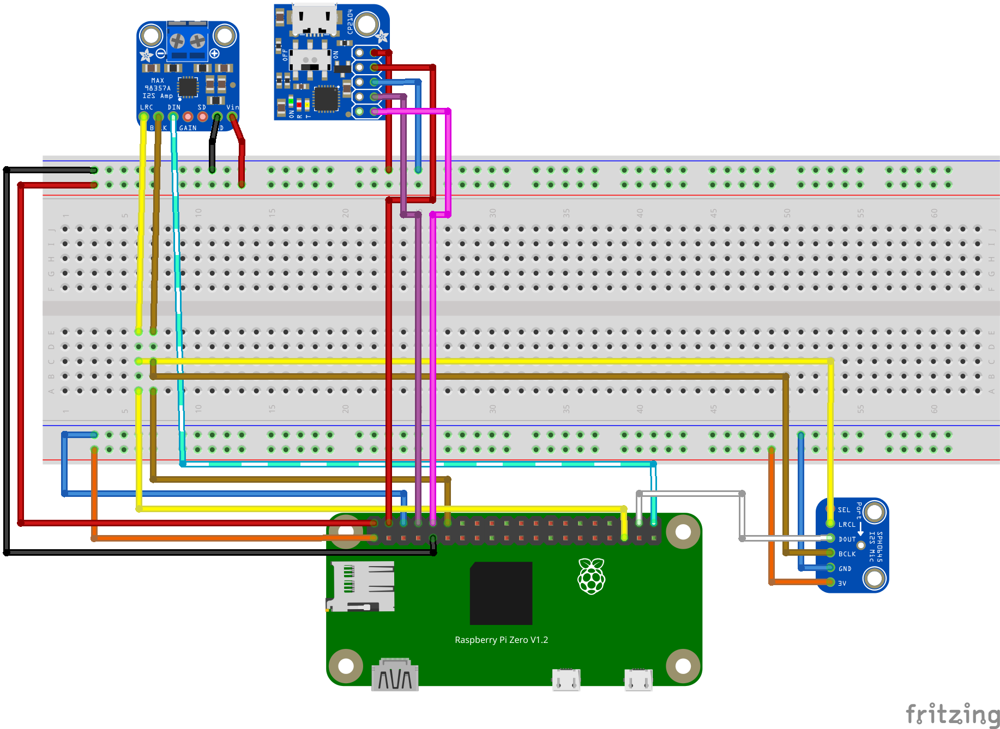

--

OcarinaOS, or Ocarina Listener, is an embedded project where you can play any monophonic instrument (like a recorder or an ocarina), and similarly to The Legend of Zelda: Ocarina of Time, have your song be recognized if it is a valid magic spell!

This project involves multiple aspects, from custom circuitry and a custom embedded Rust program, to a custom Yocto Project OS (thus the name, OcarinaOS!), and is one of my favourite side projects!

