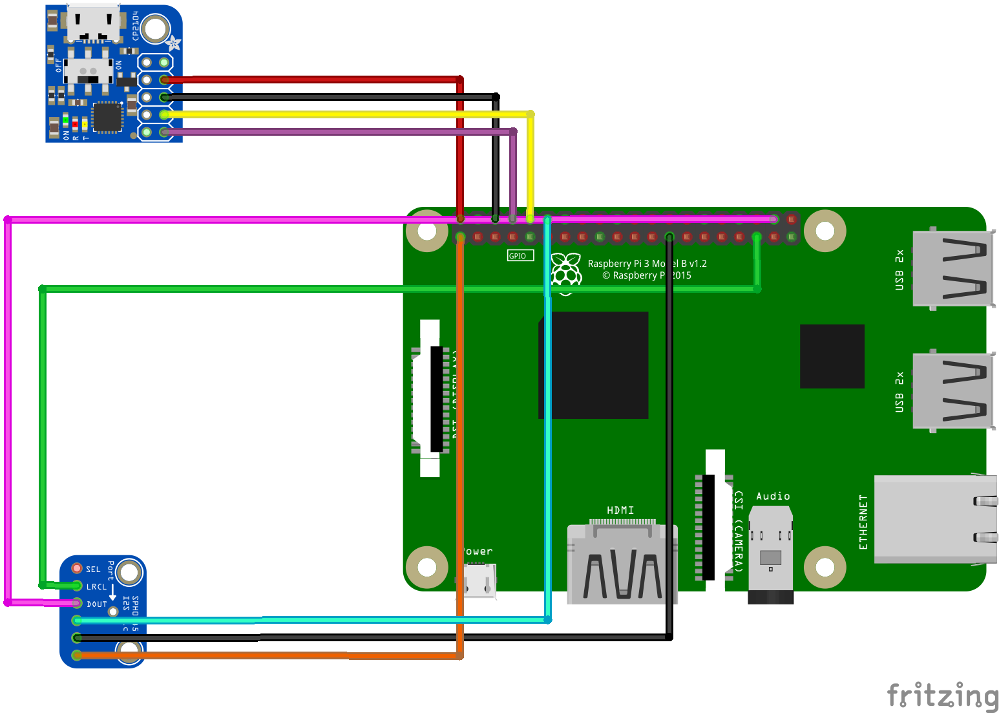
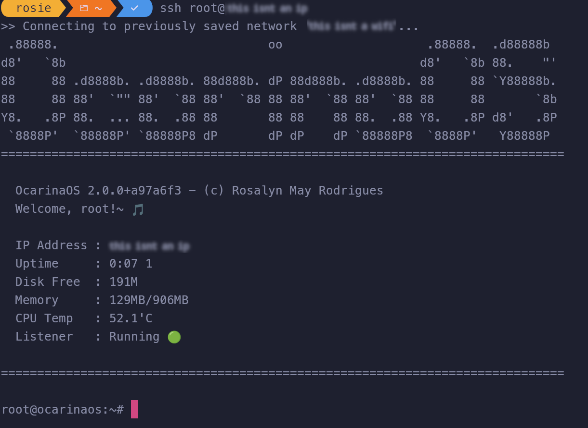
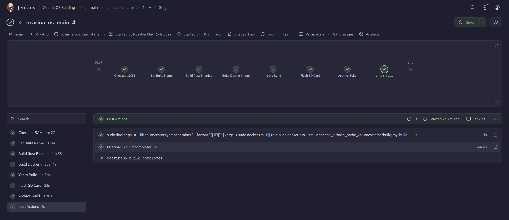
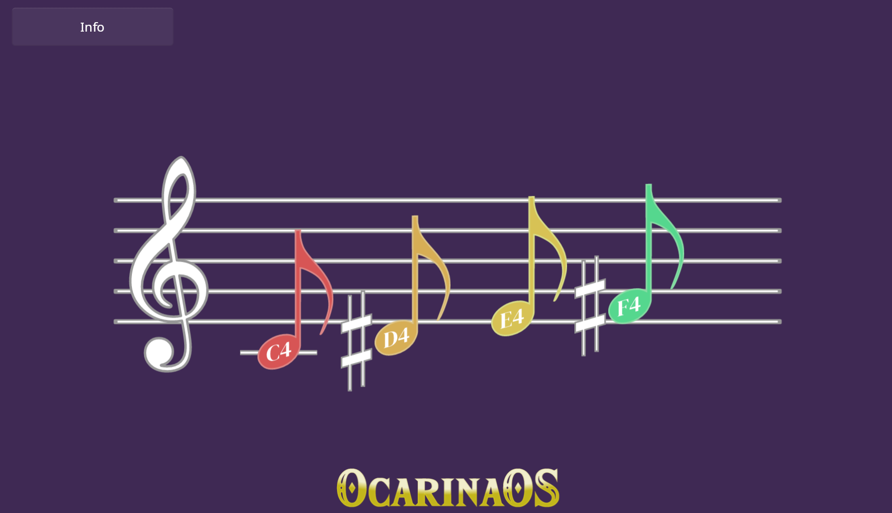

--

OcarinaOS, or Ocarina Listener, is an embedded project where you can play any monophonic instrument (like a recorder or an ocarina), and similarly to The Legend of Zelda: Ocarina of Time, have your song be recognized if it is a valid magic spell!

This project involves multiple aspects, from custom circuitry and a custom embedded Rust program, to a custom Yocto Project OS (thus the name, OcarinaOS!), and is one of my favourite side projects!

If you want more in-depth info, check out the repo's wiki!

# Circuit

The project utilizes a Raspberry Pi 3B+ as the main processor. In addition, to allow for serial communication, it features a PiUART. To capture the sound made by the user, an Adafruit I2S MEMS Microphone Breakout - ICS-43434. Finally, for the display and speakers themselves, it uses a Waveshare 7inch HDMI LCD (H) 1024x600 IPS Capacitive Touch Screen and Waveshare 8Ω 5W Speakers.

## Bill of Materials
 
### Electronics
 
| Qty | Part | Vendor | Part No. | Link |
|:---:|------|--------|----------|------|
| 1 | Raspberry Pi 3 Model B+ | Raspberry Pi | RPI3-MODBP | [product](https://www.raspberrypi.com/products/raspberry-pi-3-model-b-plus/) |
| 1 | I2S MEMS Microphone Breakout (ICS-43434) | Adafruit | 6049 | [product](https://www.adafruit.com/product/6049) |
| 1 | PiUART — USB Console and Power Add-on | Adafruit | 3589 | [product](https://www.adafruit.com/product/3589) |
| 1 | 7inch HDMI LCD (H), 1024×600 IPS Capacitive Touch | Waveshare | — | [amazon](https://www.amazon.com/dp/B07P8P3X6M) |
| 2 | 8Ω 5W Speaker | Waveshare | 8Omega 5W Speaker | [amazon](https://www.amazon.com/dp/B07C5WCDQK) |
| 1 | Solderless breadboard, 94 × 65mm | generic | — | — |
| 1 | microSD card, 16GB+, A1 rated | any | — | — |
| 1 | 5V 2.5A micro-USB power supply | any | — | — |
 
> **Note:** the ICS-43434 breakout has been discontinued by Adafruit. The
> SPH0645LM4H ([#3421](https://www.adafruit.com/product/3421)) is a drop-in
> replacement and uses identical I2S wiring.
 
### Printed Parts
 
| Qty | Part | Material | Notes |
|:---:|------|----------|-------|
| 1 | Rupee enclosure — front shell | PLA | Triforce vents, speaker grilles |
| 1 | Rupee enclosure — rear shell | PLA | Slip-lip joint to front shell |
 
Printed on a **Modix BIG-60 V4** with a **0.8mm nozzle**. Source models are
public on Onshape:
**[OcarinaOS Enclosure](https://cad.onshape.com/documents/a5e4afaadf3bbe89d967d5f7/w/a06b0c3e42263223530ae43d/e/632b0b24e9a14c9fadb9c393)**
 
The two shells are retained by the slip-lip joint alone — **no fasteners are
required to close the enclosure.**
 
### Fasteners & Inserts
 
| Qty | Part | Spec | Use |
|:---:|------|------|-----|
| 4 | Heat-set threaded insert | M3 × 6mm (H), Ø4.5mm OD | LCD mount |
| 9 | Heat-set threaded insert | M2 × 4mm (H), Ø3.0mm OD | Pi (4), breadboard (4), PiUART (1) |
| 4 | Hex socket button head screw | M3 × 8mm | LCD |
| 9 | Hex socket button head screw | M2 × 4mm | Pi, breadboard, PiUART |
| 8 | Hex socket button head screw | M3 × TODO | Speakers |
| 8 | Hex nut | M3 | Speakers |
 
Sourced from a
[520pc M2–M5 heat-set insert kit](https://www.amazon.com/dp/B0D5V3TZLB) and a
[2000pc M2–M5 screw, nut and washer kit](https://www.amazon.com/dp/B0CQJZCC9T).
 
# Software

The project itself uses the following pieces of software:

## OcarinaOS

This is a custom-made operating system built from Poky using Yocto Project. It uses `core-image-base` to create an image for the RPi 3B+, and is as minimized as possible to achieve faster boot times! All of my project files are also in their own custom recipe, `meta-ocarina`, with `sysvinit` services that properly boot them all up. I also added details in motd for prettier login screens. It also features SSH capabilities for off-target builds and debugging.

### Build infrastructure

OS builds were also automated using Jenkins! My pipeline takes care of compiling the Rust programs, inserting their newest versions into the Yocto recipe, building using Bitbake, packing the OS image in a tar file, and actually burning the OS into a Micro SD card.

## Ocarina Listener

This is the main program, and the project's namesake, that the project depends upon, built using Rust. It listens in to the microphone input and converts raw wave data into played octaves by utilizing the McLeod Pitch Method, an algorithm made specifically for monophonic instruments and human voices.

## Ocarina GUI

This is the main program that the user themselves see, also built using Rust. Using Slint, it has a graphical user interface that displays the last played notes, the recognized song, and other useful info such as the software versions and the current IP address. It communicates with the Listener via Unix sockets!

